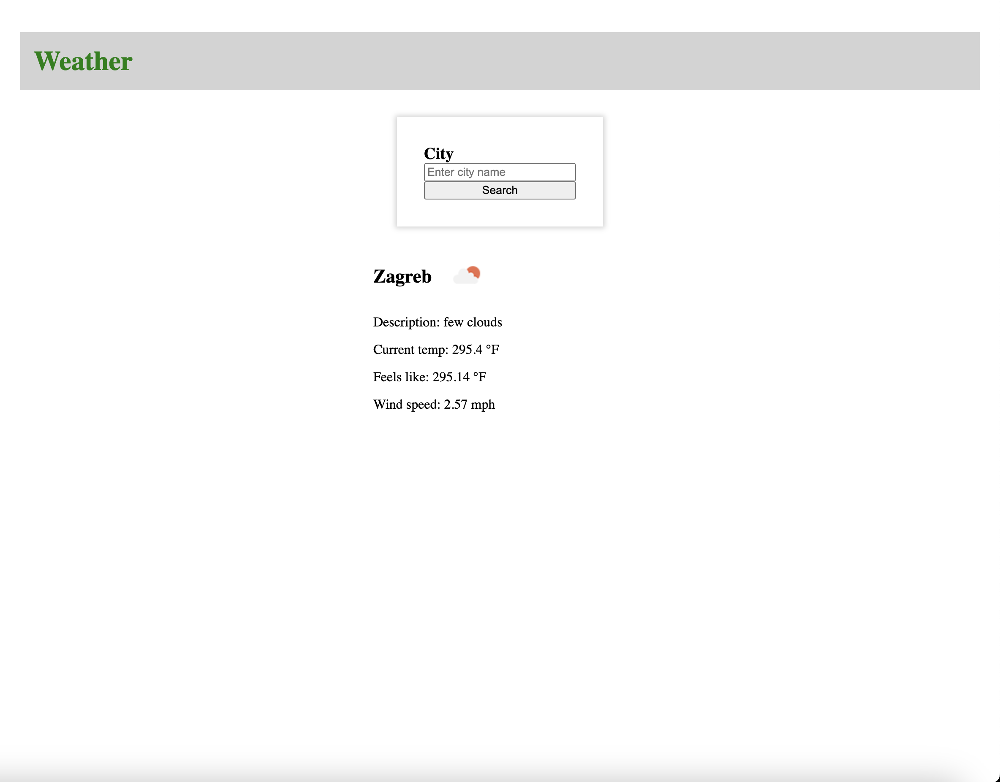

# Senicic - Upwork test



This repository contains the solution for a simple task from Upwork. It is a React application built with Vite, TypeScript, and React.

## Getting Started

1. Clone this repository to your local machine or download the ZIP file.

```bash
git clone https://github.com/senaa12/senicic-test.git
```

1. Navigate to the project directory.

```bash
cd senicic-test
```

1. Install the project dependencies.

```bash
npm install
```

1. Create .env file and place your Open Weather API key inside:

```bash
echo 'API_KEY={YOUR_OPEN_WEATHER_API_KEY}' > .env
```

## Development

To start the development server, run the following command:

```bash
npm run dev
```

This will start the development server. Any changes you make to the source code will automatically reload the browser.

## Building for Production

To build the application for production, run the following command:


```bash
npm run build
```

This will create an optimized and minified build of your application in the dist directory.
